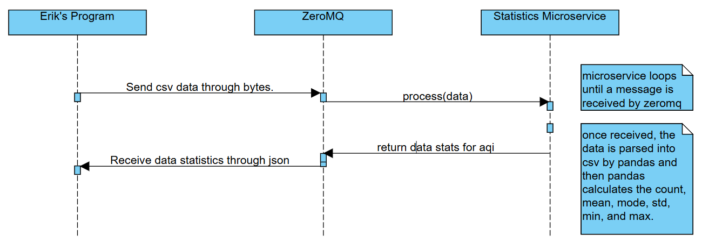

# Air Quality Statistics Microservice

This microservice processes CSV data containing air quality measurements and returns statistical analysis results.

## Communication Contract

### Requesting Data

To send data to the microservice:

1. The microservice listens on port 5555 using ZeroMQ REQ/REP pattern
2. Client should send a CSV file containing an 'aqi' column
3. Data should be sent as bytes

Example client code for sending data:
```python
import zmq

# Setup ZMQ connection
context = zmq.Context()
socket = context.socket(zmq.REQ)
socket.connect("tcp://localhost:5555")

# Read and send file
with open('data.csv', 'rb') as file:
    data_bytes = file.read()
    socket.send(data_bytes)
```

### Receiving Data

The microservice will respond with a JSON object containing the following statistics:
- total_count: Total number of records
- aqi_mean: Mean AQI value
- aqi_mode: Most frequent AQI value
- aqi_min: Minimum AQI value
- aqi_max: Maximum AQI value
- aqi_std: Standard deviation of AQI values

Example client code for receiving response:
```python
# Receive and parse response
stats = socket.recv_json()

# Example response format:
# {
#     "total_count": 1000,
#     "aqi_mean": 42.5,
#     "aqi_mode": 35.0,
#     "aqi_min": 12.0,
#     "aqi_max": 150.0,
#     "aqi_std": 25.3
# }
```

If there's an error, the response will contain an error message:
```python
{
    "Error": "Error message here"
}
```

### Required CSV Format

The input CSV file must:
- Contain a column named 'aqi'
- Have numeric values in the 'aqi' column

Example CSV format:
```
date,location,aqi
2024-01-01,Portland,35
2024-01-02,Portland,42
2024-01-03,Portland,38
```

## UML Sequence Diagram


