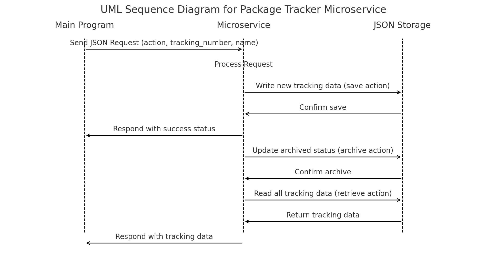

# Microservice-Package-Tracker
# How to Use the Microservice

## How to Request Data

1. Establish a connection to `tcp://localhost:5555`.
2. Send a JSON object containing the required action and additional parameters.

### Request Parameters:
- **`action`** (Required): The type of request. Can be `"save"`, `"archive"`, or `"retrieve"`.
- **`tracking_number`** (Optional): The package tracking number (needed for `"save"` and `"archive"`).
- **`name`** (Optional): The name of the package (used for `"save"`).

### Example Request:
```python
import zmq

context = zmq.Context()
socket = context.socket(zmq.REQ)
socket.connect("tcp://localhost:5555")

# Example save request
request = {"action": "save", "tracking_number": "123ABC", "name": "Laptop"}
socket.send_json(request)
response = socket.recv_json()

print(response)
```
## How to Receive Data

The microservice responds with a JSON object containing the result of the requested action.

### Response Format:
- **`status`**: `"success"` or `"error"`.
- **`message`**: A human-readable message about the operation.
- **`packages`** (For `"retrieve"` only): A list of all saved packages.

### Example Response:
```json
{
    "status": "success",
    "packages": [
        {"tracking_number": "123ABC", "name": "Laptop", "archived": false},
        {"tracking_number": "456DEF", "name": "Books", "archived": true}
    ]
}
```

### UML Diagram

